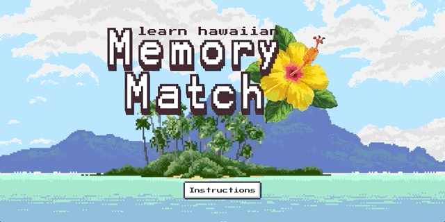
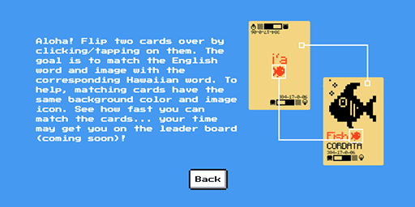
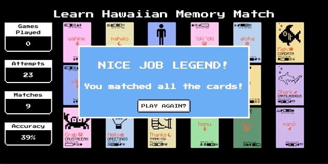

# Learn Hawaiian Memory Match

A fun memory match card game where users are required to match a card containg an English word (and helpful image) with the corresponding Hawaiian word card.  To help users learn which cards match, each matching card set has the same colored background and icon image.

## Live Demo

https://memory-match.adambotma.com/

## Functionality Overview
1. Memory match is a matching game in which a player attempts to match the images contained on "playing cards".  In this version rather than having two of the same image, one card has an English word (and an image) while the second card has the matching Hawaiian word.
2. Users are greated with a start screen and are given the option to click/tap the instructions button to learn how the game is played. 
2.  When the game starts, there are a total of 18 cards:
    - Each card contains 1 of 9 matching image pairs
    - There are two of each matching pair allowing for 9 total matches
    - to help the players know which cards are a "match", each match has the same background color and orange icon (see screenshot below)
3. The following stats are tracked:
    - Total number of games played
    -Total number of guesses for the current game
    - Total number of matches for the current game
    - The accuracy of the players attempts to match the cards in relation to the current game (as a percentage)
4. The cards are displayed face down and "flip" over when they are clicked.
5. Two cards can be flipped each round.
6. If the images of the two cards which are flipped over match:
    - a green border surrounds the playing board
    - a "match" sound is played
    - The cards remain flipped over and the player gets 1 point for the match
    - 1 point is added to the total number of attempted matches.
    - The player's accuracy is updated
7. If the two flipped over cards do not match:
    - a red border surrounds the playing board
    - a "no match" sound is played
    - The cards are flipped back over
    - 1 is added to the total number of attempts
    - The players accuracy is updated
    - The player must choose two cards again to continue searching for a match.
9. Once all 9 cards have been matched:
    - A modal is shown to the player telling them they have won.
    - A button is provided which can reset the game by clicking on it.
10. Resetting the game performs the following actions:
    - All cards are flipped back over
    - The number of games played is increased
    - The total number of matches are reset
    - The accuracy percentage is reset to 0%

## Further Development Plans
1. Create a timer so players can see how fast they are able to clear the game.
2. Create a Leaderboard for players to see how they rank (using Node.js and PostgreSQL to store leaderboard data)

## Screenshots

Welcom Screen:

Instructions Screen:

Game Play:

Win Screen:

## Design Inspiration

I loved playing old computer games as a kid (and still do).  I wanted to create a pixel art based game that reminded me of the games I used to play growing up.  A majority of the assets used for the game were created by myself with the exception of the title screen background image ().  Additional styling provided by the <a href="https://nostalgic-css.github.io/NES.css/"> NES.css framework</a>. 
